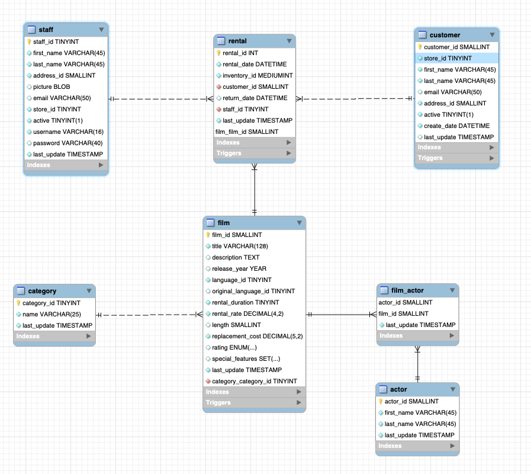

# Films Rental Backend

## Introduction

This GitHub project was created to serve as a Backend for a VueJS based single page application (SPA) using Quasar Framework.

It's a Spring Boot project with an example data model, repositories and a set of pre-defined data.

For authentication JSON Web Token (JWT) is implemented, furthermore the Database schema and data is found inside /resources folder.

## Data Model

 
